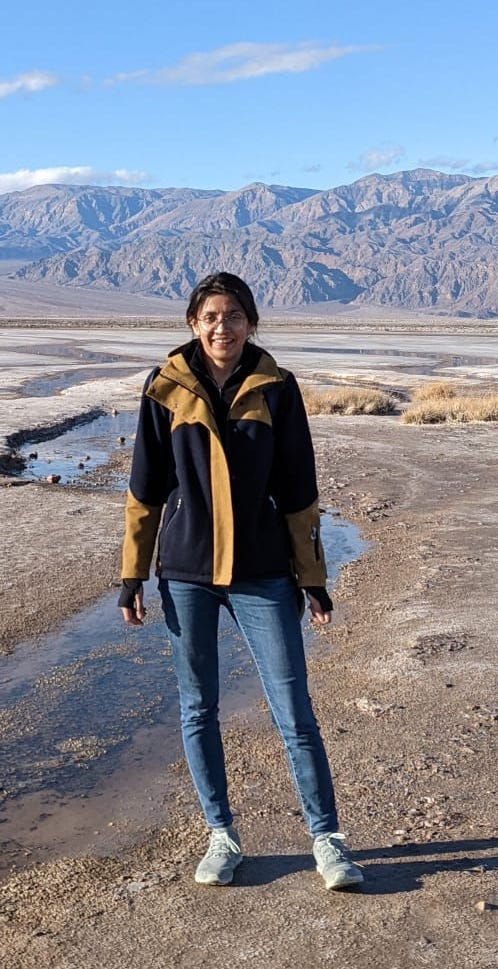

{: width="250px"}

I am an incoming Lecturer in the Department of Cell and Developmental Biology at University College London. Our group is interested in the role of mechanics in the evolution, development, and function in biological systems. 

The interdisciplinary nature of our questions calls for the use of theoretical tools from the fields of dynamical systems, differential geometry, and continuum mechanics, and we also work closely with experimental biology approaches from developmental biology, embryology, biomechanics. 

My previous work has contributed to our understanding of the role of mechanical stability on animal morphology and motor control. More recently, I have expanded my studies to include the role of mechanics in the morphogenesis and function of the vertebrate musculoskeletal systems. Learn more [here](https://neelimasharma.com/research/). 

Prior to this, I was a postdoctoral scholar in the Department of Organismal Biology and Anatomy at the University of Chicago, in the group of Neil Shubin. I did my PhD at the Department of Mechanical Engineering and Materials Science with Madhusudhan Venkadesan at Yale University, New Haven, USA. 

<!-- # You don't need to edit this file, it's empty on purpose.
# Edit theme's home layout instead if you wanna make some changes
# See: https://jekyllrb.com/docs/themes/#overriding-theme-defaults
# layout: page

<!-- Life conundrum 1: I am a graduate student who wishes that graduate school never ended. 

<!-- Life conundrum 2: I find both mathematical equations and biological experiments beautiful.  --> 

<!-- “It is not necessary to accept everything as true, one must only accept it as necessary” -->

<!-- &nbsp;&nbsp;&nbsp;&nbsp; -->

<!-- I am presently a Postdoctoral Scholar in the [Shubin Lab](https://shubinlab.uchicago.edu) at the Department of Organismal Biology and Anatomy, University of Chicago. My Ph.D. was at the Department of Mechanical Engineering and Materials Sciences at Yale University in the [Biomechanics and Control Lab](https://mvlab.yale.edu), advised by Prof. Madhu Venkadesan.  -->

<!-- [Other website](https://campuspress.yale.edu/nsharma/) -->

 

