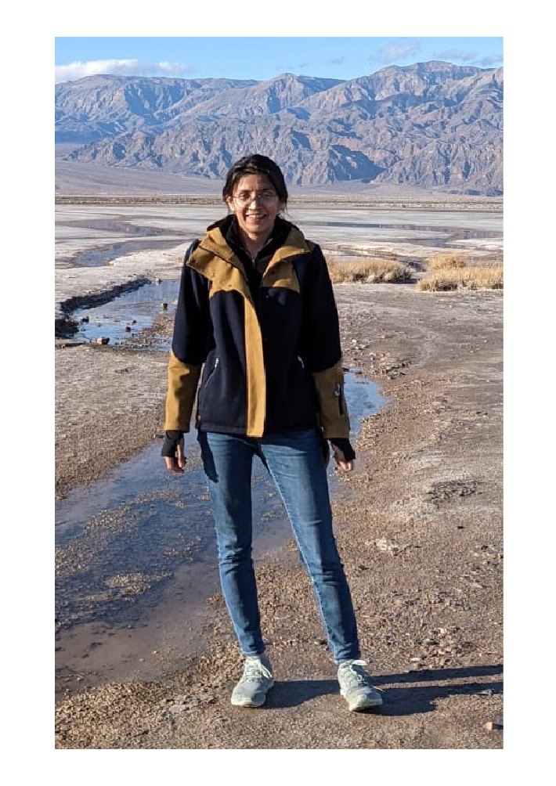

---
# You don't need to edit this file, it's empty on purpose.
# Edit theme's home layout instead if you wanna make some changes
# See: https://jekyllrb.com/docs/themes/#overriding-theme-defaults
layout: page
---
<!-- Life conundrum 1: I am a graduate student who wishes that graduate school never ended. 

<!-- Life conundrum 2: I find both mathematical equations and biological experiments beautiful.  --> 

<!-- “It is not necessary to accept everything as true, one must only accept it as necessary” -->

I did my Ph.D. under the advisement of Prof. Madhusudhan Venkadesan at the Department of Mechanical Engineering and Materials Sciences at Yale University in the Biomechanics and Control Lab. I am also a student at the Yale’s Integrated Graduate Program in Physical and Engineering Biology (PEB). I am interested in learning how morphology of animals (their form) affects their function and neural control. Specifically, I have an interest in the stability of various structures comprising the body of the animals. My main project studies how hand shape and hand muscles allow people to grasp objects. My work uses knowledge of optimization, dynamical systems, and linear algebra. I have experience with human subject experiments as well as building mechanical models to test my hypotheses. Interestingly, my projects have also led to the development of my interest in muscle mechanics and evolutionary developmental biology.

<!-- [Other website](https://campuspress.yale.edu/nsharma/) -->
